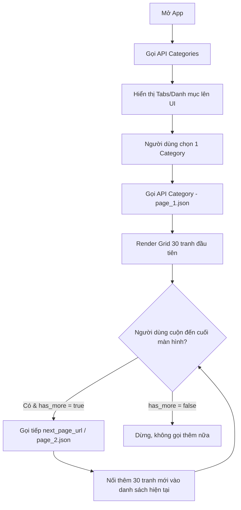

# 📖 TÀI LIỆU TÍCH HỢP API CHO FRONTEND (FE INTEGRATION GUIDE)

> **Base URL:** `https://npngocanh228.github.io/Color-DB/public/`  
> **Giao thức:** HTTPS (GET Request)  
> **Định dạng dữ liệu:** JSON  
> **Cơ chế tải:** Static JSON CDN với hỗ trợ phân trang (Load More / Infinite Scroll). Tốc độ phản hồi cực nhanh (<50ms), không lo nghẽn server.

---

## 1. TỔNG QUAN LUỒNG TÍCH HỢP (FLOW HOẠT ĐỘNG)



---

## 2. CHI TIẾT CÁC ENDPOINTS

### 📌 API 1: Lấy danh sách toàn bộ Danh mục (Categories)

Dùng để render thanh Tab ngang (Tabs bar), Menu thể loại hoặc danh sách thể loại trang chủ.

* **URL:**  
  `https://npngocanh228.github.io/Color-DB/public/api/categories.json`
* **Method:** `GET`
* **Response Body mẫu:**
  ```json
  {
    "version": 2,
    "total_categories": 31,
    "categories": [
      {
        "id": "animals",
        "folder": "animals",
        "name": "Động Vật",
        "name_en": "Animals",
        "icon_url": "https://npngocanh228.github.io/Color-DB/public/artworks/animals/01.png",
        "total_items": 1625,
        "total_pages": 55,
        "first_page_url": "https://npngocanh228.github.io/Color-DB/public/api/categories/animals/page_1.json"
      },
      {
        "id": "cute",
        "folder": "cute",
        "name": "Đáng Yêu",
        "name_en": "Cute",
        "icon_url": "https://npngocanh228.github.io/Color-DB/public/artworks/cute/01.png",
        "total_items": 2051,
        "total_pages": 69,
        "first_page_url": "https://npngocanh228.github.io/Color-DB/public/api/categories/cute/page_1.json"
      }
    ]
  }
  ```

| Trường dữ liệu | Kiểu | Ý nghĩa |
| :--- | :--- | :--- |
| `id` / `folder` | String | Mã định danh thể loại (dùng để ghép URL gọi trang con). |
| `name` | String | Tên hiển thị tiếng Việt (vd: "Động Vật", "Ẩm Thực", "Anime"). |
| `name_en` | String | Tên tiếng Anh (vd: "Animals", "Food"). |
| `icon_url` | String | Link ảnh đại diện cho category (dùng hiển thị icon/cover). |
| `total_items` | Number | Tổng số lượng tranh trong thể loại này. |
| `total_pages` | Number | Tổng số trang (mỗi trang chứa 30 tranh). |
| `first_page_url`| String | URL trang đầu tiên (`page_1.json`) để gọi trực tiếp. |

---

### 📌 API 2: Lấy danh sách tranh theo Category (Có Phân Trang / Load More)

Khi người dùng chọn một category hoặc cuộn màn hình để load more.

* **Cấu trúc URL:**  
  `https://npngocanh228.github.io/Color-DB/public/api/categories/{category_id}/page_{page}.json`
* **Ví dụ gọi thực tế:**
  * **Trang 1:** `https://npngocanh228.github.io/Color-DB/public/api/categories/animals/page_1.json`
  * **Trang 2:** `https://npngocanh228.github.io/Color-DB/public/api/categories/animals/page_2.json`
  * **Trang N:** `https://npngocanh228.github.io/Color-DB/public/api/categories/animals/page_{N}.json`
* **Method:** `GET`
* **Response Body mẫu:**
  ```json
  {
    "category": "animals",
    "category_name": "Động Vật",
    "category_name_en": "Animals",
    "page": 1,
    "limit": 30,
    "total_items": 1625,
    "total_pages": 55,
    "has_more": true,
    "next_page": 2,
    "next_page_url": "https://npngocanh228.github.io/Color-DB/public/api/categories/animals/page_2.json",
    "items": [
      {
        "id": "MAC_2022_Animals_01",
        "title": "Động Vật #3B06",
        "file_name": "MAC_2022_Animals_01.png",
        "url": "https://npngocanh228.github.io/Color-DB/public/images/MAC_2022_Animals_01.png",
        "thumbnail_url": "https://npngocanh228.github.io/Color-DB/public/images/MAC_2022_Animals_01.png",
        "category": "animals",
        "category_name": "Động Vật",
        "free": true,
        "gif": false,
        "pixelCount": 1000
      }
    ]
  }
  ```

| Trường dữ liệu | Kiểu | Ý nghĩa cho FE xử lý Load More |
| :--- | :--- | :--- |
| `page` | Int | Số trang hiện tại đang tải. |
| `has_more` | Boolean | **QUAN TRỌNG:** Nếu `true` $\rightarrow$ còn tranh, cho phép gọi tiếp. Nếu `false` $\rightarrow$ đã hết tranh, ẩn loading spinner. |
| `next_page_url`| String | URL của trang tiếp theo (FE có thể gọi thẳng link này mà không cần tự ghép chuỗi). |
| `items` | Array | Mảng 30 tranh. FE chỉ cần nối mảng này vào danh sách đang hiển thị: `currentList.addAll(newItems)`. |
| `items[].url` | String | Link ảnh gốc/blueprint phân giải cao để tải về tô màu. |
| `items[].thumbnail_url`| String | Link ảnh thumbnail hiển thị trên lưới Grid. |
| `items[].free` | Boolean | `true` = tranh miễn phí, `false` = tranh VIP (hiển thị icon ổ khóa hoặc huy hiệu VIP). |
| `items[].gif` | Boolean | `true` = ảnh động GIF, `false` = ảnh tĩnh PNG. |

---

### 📌 API 3: Lấy toàn bộ tranh không lọc theo thể loại (Tất cả tranh)
Dành cho tab "Khám phá" (Explore) hoặc "Mới nhất" (Feed).

* **Trang 1:** `https://npngocanh228.github.io/Color-DB/public/api/all/page_1.json`
* **Trang 2:** `https://npngocanh228.github.io/Color-DB/public/api/all/page_2.json`
* Cấu trúc tương tự API Category.

---

## 3. KHAI BÁO MODEL DỮ LIỆU (DATA CONTRACT)

### Kotlin (Android / Jetpack Compose)
```kotlin
data class CategoriesResponse(
    val version: Int,
    val total_categories: Int,
    val categories: List<CategoryItem>
)

data class CategoryItem(
    val id: String,
    val folder: String,
    val name: String,
    val name_en: String,
    val icon_url: String,
    val total_items: Int,
    val total_pages: Int,
    val first_page_url: String
)

data class PaginatedArtworksResponse(
    val category: String,
    val category_name: String,
    val page: Int,
    val limit: Int,
    val total_items: Int,
    val total_pages: Int,
    val has_more: Boolean,
    val next_page: Int?,
    val next_page_url: String?,
    val items: List<ArtworkModel>
)

data class ArtworkModel(
    val id: String,
    val title: String,
    val file_name: String,
    val url: String,
    val thumbnail_url: String,
    val category: String,
    val free: Boolean,
    val gif: Boolean,
    val pixelCount: Int
)
```

### TypeScript / Dart (Flutter / React Native)
```typescript
interface CategoryItem {
  id: string;
  folder: string;
  name: string;
  name_en: string;
  icon_url: string;
  total_items: number;
  total_pages: number;
  first_page_url: string;
}

interface PaginatedArtworksResponse {
  category: string;
  category_name: string;
  page: number;
  limit: number;
  total_items: number;
  total_pages: number;
  has_more: boolean;
  next_page: number | null;
  next_page_url: string | null;
  items: ArtworkModel[];
}

interface ArtworkModel {
  id: string;
  title: string;
  file_name: string;
  url: string;
  thumbnail_url: string;
  category: string;
  free: boolean;
  gif: boolean;
  pixelCount: number;
}
```

---

## 4. CODE MẪU XỬ LÝ LOAD MORE (LOGIC CHUẨN CHO FE)

### A. Code mẫu Kotlin (Android Coroutines & ViewModel)
```kotlin
class CategoryViewModel : ViewModel() {
    private var currentPage = 1
    private var isEndReached = false
    var isLoading = false
    
    val artworkList = mutableStateListOf<ArtworkModel>()

    fun loadFirstPage(categoryId: String) {
        currentPage = 1
        isEndReached = false
        artworkList.clear()
        fetchPage(categoryId, currentPage)
    }

    fun loadMore(categoryId: String) {
        if (isLoading || isEndReached) return
        fetchPage(categoryId, currentPage + 1)
    }

    private fun fetchPage(categoryId: String, pageToLoad: Int) {
        isLoading = true
        viewModelScope.launch(Dispatchers.IO) {
            try {
                val url = "https://npngocanh228.github.io/Color-DB/public/api/categories/$categoryId/page_$pageToLoad.json"
                val response = apiService.getPage(url) // Dùng Retrofit / Ktor / OkHttp
                
                withContext(Dispatchers.Main) {
                    artworkList.addAll(response.items)
                    currentPage = response.page
                    isEndReached = !response.has_more
                    isLoading = false
                }
            } catch (e: Exception) {
                isLoading = false
            }
        }
    }
}
```

### B. Code mẫu Flutter (Dio / Http)
```dart
class ArtworkController extends ChangeNotifier {
  List<ArtworkModel> items = [];
  int currentPage = 1;
  bool hasMore = true;
  bool isLoading = false;

  Future<void> fetchFirstPage(String categoryId) async {
    currentPage = 1;
    hasMore = true;
    items.clear();
    await _fetchData(categoryId, 1);
  }

  Future<void> loadMore(String categoryId) async {
    if (isLoading || !hasMore) return;
    await _fetchData(categoryId, currentPage + 1);
  }

  Future<void> _fetchData(String categoryId, int page) async {
    isLoading = true;
    notifyListeners();

    final url = "https://npngocanh228.github.io/Color-DB/public/api/categories/$categoryId/page_$page.json";
    final res = await http.get(Uri.parse(url));

    if (res.statusCode == 200) {
      final data = PaginatedArtworksResponse.fromJson(jsonDecode(res.body));
      items.addAll(data.items);
      currentPage = data.page;
      hasMore = data.hasMore;
    }

    isLoading = false;
    notifyListeners();
  }
}
```

---

## 5. LƯU Ý QUAN TRỌNG KHI HIỂN THỊ TRÊN UI

1. **Hiển thị huy hiệu VIP:**  
   Kiểm tra `item.free == false`. Nếu người dùng chưa nâng cấp tài khoản VIP, hiển thị icon ổ khóa `🔒` hoặc nhãn `VIP` góc trên ảnh.
2. **Hỗ trợ ảnh GIF:**  
   Kiểm tra cờ `item.gif == true`. Nếu là ảnh động, dùng thư viện hỗ trợ render GIF (như `CoilImage` / `Glide` trên Android, hoặc `Image.network` trên Flutter) và hiển thị icon `GIF` nhỏ ở góc để người dùng biết.
3. **Cache ảnh (Image Caching):**  
   Vì tranh có URL cố định trên CDN, FE nên bật cấu hình Disk Cache để người dùng khi lướt lại các tranh đã xem không tốn dung lượng 4G/Wifi.
